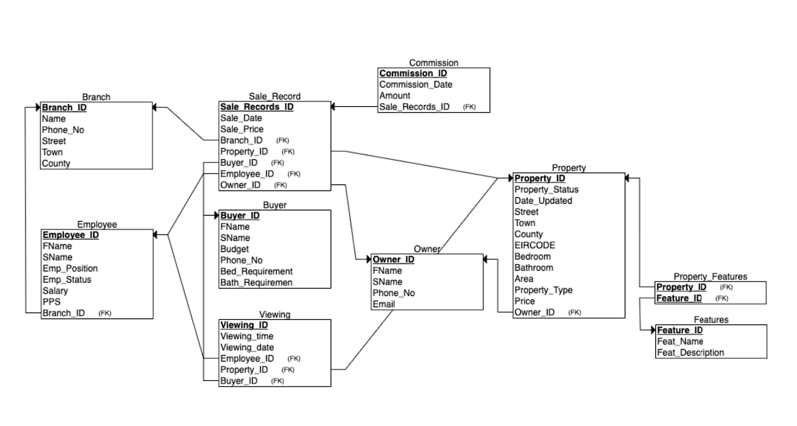

# Estate_Agency_Database

## Introduction to the System
I have designed and implemented a database for an Estate Agency Company called Casa Hunt. This company has branches spread over the country which helps people buy and sell their properties. The database that I have implemented keeps track of the agency’s branches, employees, buyers, sellers, properties and some additional things like features, commissions, property viewings and sale records. This is done by using tables and implementing constraints and triggers on which ensures the database’s integrity and smooth functioning.

The Branch table has 6 attributes - Branch_ID which is the primary key, Name, Phone_No, Street, Town and County. A constraint have been added on Phone_No. is a 10 digit number.

The Employee table has 8 attributes - Employee_ID which is the primary key, FName, SName, Emp_Position which tells if the employee is a Manager or Executive, Emp_Status which indicates if the employee is an active employee or has left the company, Salary, PPS and Branch_ID. Branch_ID is the foreign key which is used to know the branch where the employee works at. To ensure that the PPS number is right, I have added a constraint that the PPS number must be of length 9 and also must start with be a letter. Constraints on Emp_Position checks that the input is either Manager or Executive and on Emp_Status checks it is either Active or Inactive.

The Owner table has 5 attributes - Owner ID which is the primary key, FName, SName, Phone_No. and Email. Similar to Branch table a constraint has been added on Phone_No. which ensures that the length is equal to 10 numbers. A constraint on Email also verifies that there is an @ and . symbol with text before and after @. The Contact Number has been selected as NOT NULL because the Owner of the house has be contacted.

The Buyer Table stores the information of customers who are looking to buy a property from the agency. This table has 7 attributes - Buyer_ID which is the primary key, FName, SName, Budget, Phone_No., Bed_Requirement and Bath_Requirement. Budget, Bed and Bath requirement columns are optional in case the Buyer is looking for different options.

The Features table is a table which has a list of features that a property can have. It has 3 attributes - Feature_ID (Primary Key), Feat_Name and Feat_Description. The description field is optional as sometimes feature name is enough to convey thr information. Due to a many to many relationship with property, the table is normalised using primary keys of both tables and make a separate table which I call Property_Features.

Property table has 13 attributes - a primary key Property_ID, Property_Status which indicates if the property is still on the market, Date_Updated which indicates the date when the details of the property were updated, Price, Street, Town, County, EIRCODE, Bedroom showing the number of bedrooms, Bathroom, Area and Type which tells if the property is a House, Apartment, Duplex, Bungalow, Cottage or Other and Owner_ID which is a foreign key showing the owner of the property. I have added multiple constraints on various columns of the table like - a constraint on EIRCODE should always start with a letter and it must be of length 7. I have made sure that the Property status must be either For Sale, Sale Agreed or Sold, else it must be deleted from the database.
I have made sure using triggers that when the property is sold, the buyer becomes the new owner and its Owner_ID is tagged with the house.

The Viewing table keeps a record of all the viewings that the employee has organised for prospective buyers for a particular property. The table has 6 attributes - Viewing_ID, Viewing_Time, Viewing_Date, Employee_ID, Property_ID and Buyer_ID. The last 3 attributes are foreign keys which tracks the employee who held the viewing for a particular property and for which buyer.

I have created a View which can be seen by all called Viewing_List which shows Viewing ID, Property Name, Visitor’s Name, Date, Time and Employee’s details who showed the property.

Sale_Record keeps track of all the property sales done in the agency as a central system. When the property is sold (not sale agreed), the manager enters the details of all the related parties and employee. It has 8 attributes - Sale_Record_ID which is the primary key, Sale_Date, Sale_Price, Branch_ID, Property_ID, Buyer_ID, Employee_ID and Owner_ID. The last 5 attributes are foreign keys used to store the details of Branch where the sale was made, Property information and also the information of Buyer, Seller and Employee.

I have made 2 triggers based on this table which is responsible for changing the ownership of the property automatically and also generates commission in the commission table (that too automatically).

The Commission table has 4 attributes. This table is used to calculate the commission of employee when a property is sold. The attributes are - Commission_ID (Primary Kay), Date, Amount, Sales_Records_ID.

The entries in these tables are generated when the Manager adds the sale information of a property in the Sale Record.

 
## Entity Relationship Diagram

  

 
## Relational Schema Diagram

  

